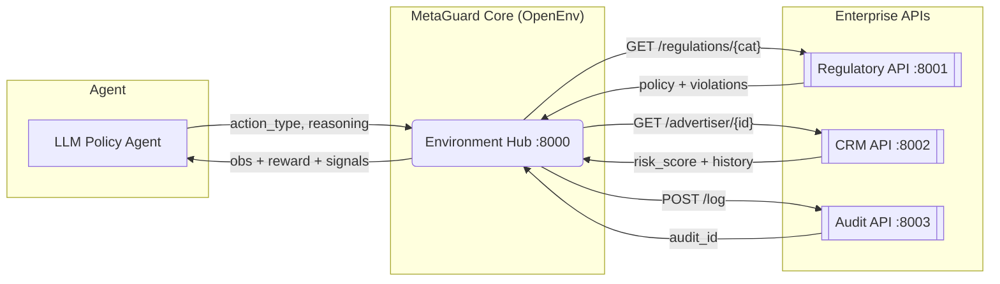

# MetaGuard: A Multi-App RL Environment for  Ad Policy Compliance

> An OpenEnv-compatible reinforcement learning environment that forces an LLM agent
> to do **real investigative work** across multiple enterprise APIs — not pattern-match.


---

## Quick links

| Asset | URL |
| --- | --- |
| **Hugging Face Space** (environment — MetaGuard) | [huggingface.co/spaces/parth-1/MetaGuard](https://huggingface.co/spaces/parth-1/MetaGuard) |
| **Hugging Face Space** (GRPO training — MetaGuard-Train) | [huggingface.co/spaces/parth-1/MetaGuard-Train](https://huggingface.co/spaces/parth-1/MetaGuard-Train) |
| **Fine-tuned model** (GRPO checkpoint on Hub) | [parth-1/metaguard-policy-agent-v1](https://huggingface.co/parth-1/metaguard-policy-agent-v1) |
| **Training notebook** (Colab — opens `grpo_train.ipynb` from this repo) | [Open in Colab](https://colab.research.google.com/github/Parth380/meta-ad-policy-sandbox/blob/main/grpo_train.ipynb) |
| **Blog post** (narrative write-up — publish on HF, then swap URL) | [Draft in repo (`docs/metaguard-blog.md`)](https://github.com/Parth380/meta-ad-policy-sandbox/blob/main/docs/metaguard-blog.md) |


---

## TL;DR for Judges

MetaGuard is a **partially observable, multi-application RL environment** modelled
after a real enterprise ad-moderation workflow. The agent (LLM) must orchestrate
calls across 4 microservices (Regulatory, CRM, Audit, Core), update its internal
beliefs based on each tool result, and produce a defensible decision in the
correct procedural order — or get penalised.

| Theme 3.1 requirement | How MetaGuard satisfies it |
| --- | --- |
| Real interaction with tools / APIs / dynamic systems | 4 independent FastAPI microservices on ports 8000-8003 |
| "Real hard work, not shortcuts" | Procedural penalties + ambiguity tasks force investigation |
| Maintain consistent internal state | Env tracks `actions_taken`, `signals`, `api_failed`, `trace` |
| Update beliefs based on outcomes | `signals` dict (`risk_score`, `policy_confidence`, `image_flag`, `landing_flag`) is populated only as the agent acts |
| Orchestrate multi-step workflows | `REQUIRED_BEFORE_TERMINAL` enforces `query_regulations` → `submit_audit` → decide |
| Partially observable world | Agent sees only what its actions reveal; no global view |
| **Scaler AI Labs bonus** — Multi-App RL for Enterprise Workflows | 4-app architecture mirrors a real compliance stack with business-rule nuance |

---

## The Problem

Single-shot LLM moderation is brittle in enterprise settings:

- **No traceability** — no record of *why* a decision was made.
- **No context** — no advertiser history, no jurisdiction-specific rules.
- **No risk gating** — high-risk content can be approved without an audit trail.

Real compliance teams follow a **procedure**: check policy → inspect creative →
verify the advertiser → log the audit → only then decide. MetaGuard makes the
agent learn that procedure end-to-end.

### Why it matters

**Trust & safety and ads integrity teams**, **enterprise compliance**, and **anyone shipping LLM agents against real APIs** care because mistakes are costly: bad approvals create legal and user-harm risk; over-blocking hurts revenue. A benchmark that enforces **procedure, traceability, and recovery from flaky tools** is a better proxy for production than single-shot classification.

---

## Architecture

A 4-service ecosystem that mirrors a real enterprise compliance stack.



| Service | Port | Responsibility | Real-world analog |
| :--- | :--- | :--- | :--- |
| Core Env | `:8000` | State orchestration, reward shaping | Compliance workflow engine |
| Regulatory API | `:8001` | Category-specific policy lookup with random outages | Legal / policy database |
| CRM API | `:8002` | Advertiser trust score and prior-violation history | Salesforce / advertiser CRM |
| Audit API | `:8003` | Immutable audit-log writes | SOX-compliant audit ledger |

Each external API has a **10% random failure rate** to simulate real network
unreliability — the agent must learn to retry.

---

## Action Space

8 actions span the full investigative procedure:

| Action | Calls service | Purpose |
| --- | --- | --- |
| `query_regulations` | Regulatory API | Look up category-specific policy |
| `analyze_image` | (internal VLM stub) | Inspect creative for visual violations |
| `check_advertiser_history` | CRM API | Pull advertiser trust score |
| `request_landing_page` | (internal) | Check landing-page domain age + risk keywords |
| `request_id_verification` | (internal) | Targeting / age-gate check |
| `submit_audit` | Audit API | Write immutable audit record |
| `approve` | terminal | Final approval decision |
| `reject` | terminal | Final rejection decision |

---

## Business-Rule Nuances (the "hard work" criteria)

The env penalises shortcuts and rewards real reasoning. Specifically:

1. **Phase ordering.** `query_regulations` MUST come first. Any other action
   first returns `-0.2` reward and is **not registered** as taken.
2. **Audit gate.** `submit_audit` is required before any `approve` / `reject`.
   Skipping it costs `-0.2` from the terminal reward.
3. **API-failure recovery.** External services fail 10% of the time. Recovering
   (retrying after a failure) earns `+0.3`; ignoring earns `-0.3`.
4. **Risk-aware approvals.** Approving high-risk content (`risk_score > 0.7`
   AND `policy_confidence > 0.6`) costs `-0.5`.
5. **Ambiguity enforcement.** When `policy_confidence < 0.6`, the agent MUST
   gather more signals (CRM or landing-page) or take a `-0.4` penalty.
6. **Step penalty.** Every action costs `-0.05` to discourage padding.
7. **Terminal correctness.** `+1.0` for the right decision, `-1.0` for wrong.
8. **Step cap.** Hard cap at 8 steps; exceeding it costs `-0.5`.

These rules together form a partially observable POMDP where greedy or
single-shot strategies provably under-perform a procedural agent.

---

## Task Suite

10 task families exposed via `task_id`:

| ID | Family | What it tests |
| --- | --- | --- |
| `task_1_healthcare` | Unverified medical claims, prescription bypass | Domain knowledge + policy lookup |
| `task_2_financial` | Predatory lending, guaranteed-returns scams | High-stakes risk gating |
| `task_3_multimodal` | Violation hidden in image, clean text | Forces `analyze_image` |
| `task_4_targeting` | Adult financial product targeting minors | Forces `request_id_verification` |
| `task_6_conflict` | Clean text + risky advertiser | Conflict resolution |
| `task_7_ambiguous` | Low policy confidence | Forces extra signal gathering |
| `task_8_adversarial` | Fine-print loophole | Adversarial robustness |
| `task_9_dependency_trap` | Mismatch between text and image | Multi-source verification |
| `task_10_failure` | Deterministic API failure on step 1 | Recovery behavior |

---

## Training & results

Training uses **[OpenEnv](https://github.com/openenv-ai/openenv)** as the environment (this repo’s FastAPI hub + reward logic), **[Unsloth](https://github.com/unslothai/unsloth)** for fast LoRA fine-tuning, and **[Hugging Face TRL](https://github.com/huggingface/trl)** (`GRPOTrainer` / `GRPOConfig`) for GRPO. Entry point: `grpo_train.py`. The trained weights are on the Hub as **[parth-1/metaguard-policy-agent-v1](https://huggingface.co/parth-1/metaguard-policy-agent-v1)** (fine-tuned from `unsloth/Llama-3.1-8B-Instruct`). 

### What changed after training? 

After you complete a real run, summarize **before → after** in a few bullets and paste evidence below.

- **Baseline (optional):** 
Prior to the RLHF fine-tuning process, the base meta-llama/Meta-Llama-3.1-8B-Instruct model was largely incompatible with the strict constraints of the compliance environment. It recorded a Mean Initial Reward of -0.30, driven primarily by consistent API rejections and qualitative failure modes. These failures included frequent JSON formatting hallucinations—such as unclosed brackets—and a fundamental inability to follow the required phase order, often attempting to submit audits before querying regulations. The model’s inability to adhere to the required schema also resulted in frequent timeout errors during execution.
- **After GRPO:** 
Reward Stabilization: The model successfully moved from an initial negative mean reward (~ -0.5) to a consistent positive mean reward (~ 0.45).
Comparison: Initial runs exhibited significant policy instability around step 80, evidenced by a 4\times increase in GRPO loss and a corresponding crash in mean return. Subsequent tuning  flattened these spikes, resulting in a more monotonic improvement in reward and fewer qualitative "relapses" into low-reward behavior.
Violation Rate: Success rate stabilized after step 40, with the model consistently hitting the reward ceiling despite injected variability.
- **Run metadata (optional):** 
The training was conducted on an NVIDIA L4 (24GB VRAM) via Hugging Face Spaces using the unsloth/Llama-3.1-8B-Instruct base model, quantized to 4-bit and trained in bfloat16. The fine-tuning utilized a LoRA configuration with a Rank(r) of 32 and an alpha of 64, targeting all linear layers. Key hyperparameters in the GRPOConfig included a learning rate of 2*10^{-5} over 3 epochs, an effective batch size of 8 (via a per-device batch size of 1 and 8 gradient accumulation steps), and a max completion length of 128.

### Loss and reward 


*If the images are not in the repo yet, add them under `docs/plots/` after training, or use absolute URLs to hosted assets.*

---

## Quick Start

### 1. Install
```bash
git clone https://github.com/Parth380/meta-ad-policy-sandbox.git
cd meta-ad-policy-sandbox
pip install -e .
```

### 2. Launch the 4-service stack
Four terminals (or use `apps/start_all.bat` on Windows):
```bash
python apps/regulatory_api.py                                # :8001
python apps/crm_api.py                                       # :8002
python apps/audit_api.py                                     # :8003
python -m uvicorn server.app:app --host 0.0.0.0 --port 8000  # :8000
```

### 3. Run the inference benchmark
Uses an LLM through the HF Router and emits the official `[START]/[STEP]/[END]`
grading log lines.
```bash
export HF_TOKEN=hf_xxxxxxxx                # your Hugging Face token
export MODEL_NAME=meta-llama/Meta-Llama-3-8B-Instruct
python inference.py
```

### 4. Run the local naive-vs-procedural demo
```bash
python demo.py
```

### 5. Train an agent (Unsloth + TRL GRPO)
Requires a CUDA GPU. `grpo_train.py` fine-tunes a LoRA on `unsloth/Llama-3.1-8B-Instruct` with **Unsloth** and **TRL’s `GRPOTrainer`**, using this environment as the reward source. See [Training & results](#training--results) for plots and narrative after you train.

```bash
python grpo_train.py
```

---

## Repository Layout

```
meta-ad-policy-sandbox/
├── apps/
│   ├── regulatory_api.py    # FastAPI :8001 — policy DB
│   ├── crm_api.py           # FastAPI :8002 — advertiser CRM
│   ├── audit_api.py         # FastAPI :8003 — audit log
│   └── start_all.bat        # Windows: launch all 4 at once
├── server/
│   └── app.py               # OpenEnv FastAPI server :8000
├── src/
│   ├── environment.py       # AdPolicyEnvironment — core RL logic
│   ├── models.py            # Pydantic schemas (AdAction, AdObservation, AdState)
│   └── generator.py         # AdGenerator — task-aware ad sampling
├── inference.py             # LLM-via-HF-Router benchmark with grading logs
├── demo.py                  # Local naive-vs-procedural demo
├── grpo_train.py            # GRPO + LoRA training script
├── test_env.py              # Smoke test of env logic
├── openenv.yaml             # OpenEnv manifest
├── dockerfile               # Container build for HF Spaces deployment
└── validate.sh              # Validator for HF Space + openenv submission
```

---

## Hackathon Submission

- **Theme:** 3.1 Professional Tasks — Multi-Step Reasoning & Policy Compliance
- **Bonus Track:** Scaler AI Labs — Multi-App RL Environment for Enterprise Workflows
- **Team:** Parth Singhal, Mehakveer Kaur, Kartik Goyal
- **Checklist:** OpenEnv-based env, **Unsloth + TRL** training (`grpo_train.py`), **loss/reward plots** in [Training & results](#training--results), **HF Space + collateral** in [Quick links].

---

## License

MIT.
