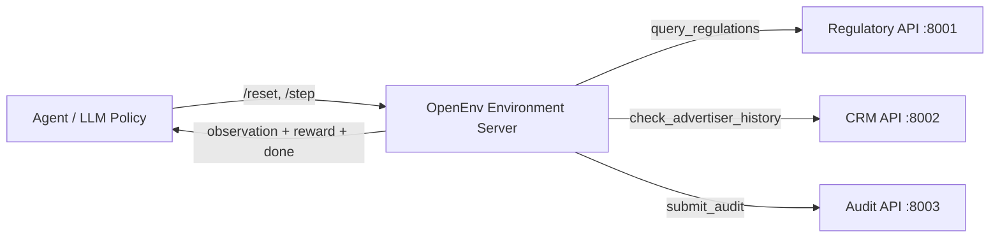

# Meta Ad-Policy RL Sandbox

[](#)
[](#)
[](#)
[](#)

A **professional-grade reinforcement learning environment** for ad-policy moderation, designed for **Meta × Scaler Hackathon Round 2 (Theme 3.1: Professional Tasks)**.

This project simulates a realistic enterprise moderation workflow where an agent must coordinate across multiple tools and APIs, reason under partial observability, and execute a compliant multi-step decision process.

---

## Why this project is strong for Theme 3.1

Theme 3.1 asks for environments requiring **real interaction with tools/APIs**, **persistent state tracking**, and **causal multi-step reasoning**.

This sandbox enforces that directly:
- Multi-app orchestration: Regulatory DB API, CRM API, Audit API + OpenEnv environment server.
- Process-gated decisions: agent cannot approve/reject without completing required compliance workflow.
- Partial observability: multimodal traps and targeting violations require tool use beyond superficial text cues.
- Reward shaping: cost of unnecessary steps, reward for correct final decision.

---

## System architecture



### Services
- **Environment Server (`server/app.py`)**: OpenEnv-compatible task engine and episode lifecycle.
- **Regulatory API (`apps/regulatory_api.py`)**: policy summaries and risk-level knowledge.
- **CRM API (`apps/crm_api.py`)**: advertiser history / prior violations.
- **Audit API (`apps/audit_api.py`)**: compliance trail logging.

---

## Core capabilities

### 1) Enterprise workflow enforcement
The environment uses explicit **phase gates** before terminal actions:
1. Query regulations
2. Analyze image (required for multimodal tasks)
3. Submit audit
4. Approve / Reject

This design prevents cheap shortcuts and encourages policy-grounded reasoning.

### 2) Adversarial scenario generation
Includes four targeted task families:
- `task_1_healthcare`
- `task_2_financial`
- `task_3_multimodal`
- `task_4_targeting`

Scenarios include obvious violations, subtle policy evasion, and high-trust multimodal traps.

### 3) Structured reward design
- Step/tool-use penalty to discourage redundant actions
- Gate penalties for non-compliant sequencing
- High terminal reward for correct classification, high penalty for wrong final action

---

## Repository layout

```text
.
├── apps/
│   ├── regulatory_api.py
│   ├── crm_api.py
│   ├── audit_api.py
│   └── start_all.bat
├── server/
│   └── app.py
├── src/
│   ├── environment.py
│   ├── generator.py
│   ├── models.py
│   └── __init__.py
├── inference.py
├── grpo_train.py
├── openenv.yaml
├── pyproject.toml
├── requirements.txt
└── dockerfile
```

---

## Quick start

### Option A: Local (recommended for development)

```bash
# 1) Create and activate virtual environment (example)
python -m venv .venv
source .venv/bin/activate  # Windows: .venv\Scripts\activate

# 2) Install dependencies
pip install -e .

# 3) Start support APIs (in separate terminals)
python apps/regulatory_api.py
python apps/crm_api.py
python apps/audit_api.py

# 4) Start environment server
uvicorn server.app:app --host 0.0.0.0 --port 8000
```

### Option B: Docker (environment server)

```bash
docker build -t meta-ad-sandbox .
docker run -p 8000:8000 meta-ad-sandbox
```

> Note: The container runs the environment server. For full multi-service workflow, run the auxiliary APIs as separate services/processes.

---

## Running the baseline inference agent

Set model access variables and run:

```bash
export HF_TOKEN="<your_hf_token>"
export API_BASE_URL="https://router.huggingface.co/v1"
export MODEL_NAME="meta-llama/Meta-Llama-3-8B-Instruct"

python inference.py
```

The script executes all tasks and prints strict start/step/end logs suitable for evaluation parsing.

---

## API contract (high level)

### OpenEnv server
- `POST /reset` → returns initial observation
- `POST /step` with `{"action": {...}}` → returns updated observation, reward, done

### Action payload

```json
{
  "action": {
    "action_type": "query_regulations",
    "reasoning": "Check policy constraints before decision"
  }
}
```

### Common action types
- `query_regulations`
- `analyze_image`
- `check_advertiser_history`
- `request_landing_page`
- `request_id_verification`
- `submit_audit`
- `approve`
- `reject`

---

## Evaluation design

Each episode tests:
1. **Process compliance** (did the agent follow enterprise workflow?)
2. **Evidence quality** (did it use the right tools?)
3. **Decision accuracy** (approve/reject correctness)
4. **Efficiency** (reward impact from unnecessary actions)

Recommended reporting for judges:
- Success rate by task
- Mean reward by task
- Average steps-to-decision
- Gate-failure breakdown (policy/image/audit)
- Tool-usage distribution

---

## Training path (GRPO)

`grpo_train.py` provides a GRPO setup where reward functions call the live environment.

Use this when you want policy improvement against true environment feedback rather than static supervised labels.

---

## Judge-facing demo script (suggested)

1. Show one **multimodal trap** where text appears safe.
2. Demonstrate failed outcome when image analysis is skipped.
3. Demonstrate successful outcome with full workflow.
4. Show audit log entry for traceability.
5. Summarize benchmark metrics across all 4 tasks.

This makes the “professional workflow” value obvious in under 2 minutes.

---

## Productionization roadmap (Round 2 upgrades)

- Persistent audit storage and retrieval endpoints
- Dynamic policy/version updates during episodes
- SLA/failure simulation (API timeout, stale CRM records)
- Configurable service URLs through environment variables
- Reproducible benchmark artifact generation (`json` + markdown summary)
- Action schema unification shared across environment/model/inference

---

## Troubleshooting

- **`/step` validation errors**: ensure action schema and action names are aligned.
- **Low scores on multimodal task**: verify agent always calls `analyze_image` before final decision.
- **Audit gate failures**: ensure `submit_audit` is called before `approve`/`reject`.
- **HF Router issues**: check `HF_TOKEN`, credits, and model availability.

---

## License

For hackathon use/demo. Add explicit license text (MIT/Apache-2.0) before public release.

---

## Contact / Team

Add your team details and architecture diagram in submission materials for maximum judge clarity.
