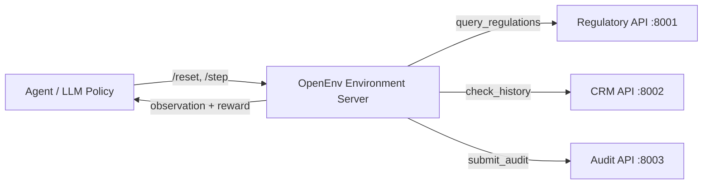

```markdown
# MetaGuard: Enterprise Ad-Policy RL Sandbox


MetaGuard is a high-fidelity Reinforcement Learning (RL) environment designed for ad-policy moderation. It simulates a production-grade enterprise ecosystem where AI agents must navigate multi-step compliance workflows, coordinate across distributed microservices, and overcome adversarial multimodal "traps."

---

## 🏗️ System Architecture

MetaGuard utilizes a distributed microservice architecture to mimic a production moderation stack.



### Integrated Services
* **Environment Hub (`:8000`)**: Orchestrates the episode lifecycle and enforces procedural phase gates.
* **Regulatory API (`:8001`)**: Provides category-specific policy constraints and risk levels.
* **Advertiser CRM (`:8002`)**: Manages advertiser trust scores and historical violation records.
* **Audit API (`:8003`)**: Persists the "Chain of Thought" and decision logs for full traceability.

---

## 🧠 Methodology: GRPO + Unsloth

To advance beyond simple instruction following, the system implements **Group Relative Policy Optimization (GRPO)** for fine-tuning.

* **Efficiency:** Optimized via **Unsloth** to enable 8B model training on consumer-grade GPUs with significantly reduced VRAM footprint.
* **Critic-less RL:** GRPO calculates rewards based on group relative performance, eliminating the need for a separate Reward Model/Critic.
* **Dynamic Training:** The training loop interacts with the **live environment** directly, allowing the model to learn from real-time API feedback.

---

## 🚦 Procedural Action Space

The environment enforces a strict Standard Operating Procedure (SOP). Failure to follow this sequence results in negative rewards and blocked terminal actions.

1. **`query_regulations`**: Fetch policy constraints (Mandatory initial step).
2. **`analyze_image`**: Inspect visual assets for policy "dog whistles" (Required for multimodal tasks).
3. **`check_advertiser_history`**: Consult the CRM for risk context and recidivism.
4. **`submit_audit`**: Log reasoning to the Audit API (Required before final decision).
5. **`approve` / `reject`**: Terminal actions.

---

## 🚀 Deployment Guide

### Local Microservice Setup
To initialize the full enterprise stack locally:

```bash
# 1. Install local project in editable mode
pip install -e .
pip install -r requirements.txt

# 2. Launch background microservices
python apps/regulatory_api.py
python apps/crm_api.py
python apps/audit_api.py

# 3. Start the Environment Hub
uvicorn server.app:app --host 0.0.0.0 --port 8000
```

### Running Inference
Evaluate agent compliance across adversarial task families:
```bash
export HF_TOKEN="your_token"
python inference.py
```

---

## 📊 Adversarial Task Families
The system evaluates agents on four distinct challenge categories:
* **`task_1_healthcare`**: Detection of unapproved medical claims and pharmaceutical violations.
* **`task_2_financial`**: Identification of predatory services and high-pressure financial tactics.
* **`task_3_multimodal`**: Policy violations hidden within imagery that bypass standard text filters.
* **`task_4_targeting`**: Illegal demographic targeting and age-restricted policy violations.

---

## 🛠️ Technical Design Decisions
* **Synthetic Scenario Generation:** Utilizes a dynamic `AdGenerator` to produce unique training scenarios, ensuring generalization across diverse policy edge cases.
* **Inference Rerouting:** The stack supports instant toggling to high-speed providers to manage API rate limits during large-scale evaluation.
```