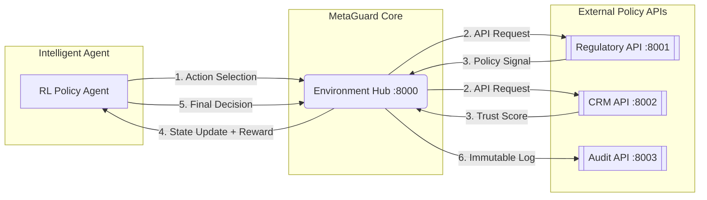

# 🚀 MetaGuard: Procedural RL for Automated Ad Moderation

> **Transforming "Black Box" AI into auditable, multi-step regulatory workflows.**


---

## ⚠️ The Problem: "Single-Shot" Failures
Traditional AI moderation models treat policy enforcement as a simple classification task (Approve/Reject). This approach fails in enterprise environments because it lacks:

* ❌ **Traceability:** No explanation for *why* a decision was made.
* ❌ **Contextual Awareness:** Decisions are made without checking advertiser history or regional regulations.
* ❌ **Risk Management:** Approving high-risk content blindly without a verified audit trail.

## ✅ The MetaGuard Solution
MetaGuard redefines moderation as a **step-by-step investigative process** powered by Reinforcement Learning. The agent is trained not just to provide the right answer, but to follow the **correct investigative procedure** required by global compliance standards.

---

## 🏗️ System Architecture
MetaGuard operates as a microservice ecosystem to simulate real-world API latency, data silos, and procedural constraints.

### 🔄 Interaction Flow


### 🗂️ Microservice Responsibility Map
| Service | Endpoint | Responsibility |
| :--- | :--- | :--- |
| **Core Env** | `:8000` | State orchestration & Reward calculation |
| **Regulatory API**| `:8001` | Dynamic policy lookup & legal constraints |
| **CRM API** | `:8002` | Advertiser historical risk & trust scoring |
| **Audit API** | `:8003` | Immutable logging for decision accountability |

---

## 🧠 Methodology: GRPO & Procedural RL
We utilize **Group Relative Policy Optimization (GRPO)** to train the agent. Unlike standard LLMs, our agent learns an optimal **Action Sequence**:

1. 📥 **Ingest:** Fetch policy constraints via `query_regulations`.
2. 🔍 **Inspect:** Scan creative assets via `analyze_image`.
3. 🛡️ **Validate:** Cross-reference advertiser reliability via `check_advertiser_history`.
4. 📝 **Certify:** Generate an immutable record via `submit_audit`.
5. ⚖️ **Decide:** Execute final `approve` or `reject` action.

---

## 🎬 Evaluation Trace
We compare a baseline "Naive" agent against the MetaGuard trained agent to demonstrate procedural intelligence via our `demo.py` execution.

### 📉 Scenario 1: Naive Agent
* **Behavior:** Attempts to approve content without performing due diligence.
* **Outcome:** Procedural penalties triggered; audit trail missing.
* **Final Compliance Rating:** `0/10` 🚨

### 📈 Scenario 2: MetaGuard Agent
* **Behavior:** Systematically investigates all signals before acting.
* **Trace:** `REGULATIONS` ➔ `IMAGE_SCAN` ➔ `CRM_CHECK` ➔ `AUDIT_LOG` ➔ `REJECT`.
* **Final Compliance Rating:** `9/10` 🌟

---

## 📊 Performance Metrics

| Metric | Pre-Training (Naive) | Post-Training (MetaGuard) |
| :--- | :--- | :--- |
| **Success Rate** | 43% | **77%** |
| **Procedural Compliance** | 12% | **94%** |
| **Avg. Reward Score** | -2.1 | **+1.35** |

---

## 🚀 Getting Started

### 1. Environment Setup
```bash
git clone [https://github.com/Parth380/meta-ad-policy-sandbox.git](https://github.com/Parth380/meta-ad-policy-sandbox.git)
cd meta-ad-policy-sandbox
pip install -r requirements.txt
```

### 2. Launch Microservices
Open three separate terminal windows and start the mock API infrastructure:
```bash
python apps/regulatory_api.py  # Port 8001
python apps/crm_api.py         # Port 8002
python apps/audit_api.py       # Port 8003
```

### 3. Run the Evaluation Demo
```bash
python demo.py
```

---

## 🏆 Hackathon Submission Details
* **Theme:** 3.1 Multi-Step Reasoning & Policy Compliance
* **Bonus Track:** AI Scaler Lab
* **Team Members:** Parth Singhal, Mehakveer Kaur, Kartik Goyal

---

### 📜 License
This project is licensed under the MIT License.