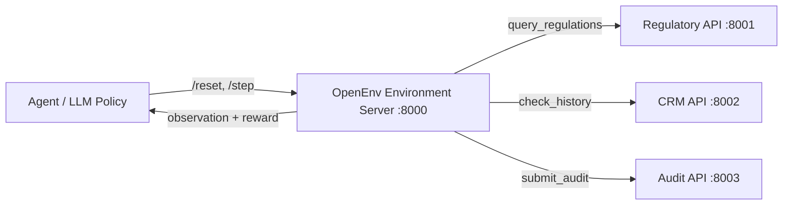

# MetaGuard: Enterprise Ad-Policy RL Sandbox

[](https://www.google.com/search?q=https://github.com/openenv/openenv)
[](https://opensource.org/licenses/MIT)
[](https://www.python.org/)
[](https://github.com/unslothai/unsloth)

**MetaGuard** is a high-fidelity Reinforcement Learning (RL) environment designed to train and evaluate AI agents on complex, multi-step ad-policy moderation workflows. Developed for the **Meta x Scaler Hackathon**, this project tackles the challenge of ensuring LLM agents follow strict Standard Operating Procedures (SOPs) while navigating adversarial multimodal "traps."

-----

## 🏆 Hackathon Submission Details

  - **Theme:** 3.1 (Multi-Step Reasoning & Policy Compliance)
  - **Bonus Track:** AI Scaler Lab
  - **Team Members:** Parth Singhal, Mehakveer Kaur, Kartik Goyal

-----

## 🏗️ System Architecture: Distributed Microservices

MetaGuard mimics a real-world enterprise ecosystem by decoupling environment logic from policy and data services. This ensures that the agent must interact with live APIs to gather context before making terminal decisions.



### Integrated Services

  * **Environment Hub (`:8000`)**: Orchestrates the episode lifecycle using **OpenEnv** and enforces procedural phase gates.
  * **Regulatory API (`:8001`)**: Provides category-specific policy constraints (e.g., Healthcare, Finance).
  * **Advertiser CRM (`:8002`)**: Manages trust scores and historical violation records to simulate risk-based decision-making.
  * **Audit API (`:8003`)**: Persists the "Chain of Thought" (CoT) and decision logs for full traceability.

-----

## 🧠 Methodology: GRPO + Unsloth

To move beyond simple instruction following, we utilize **Group Relative Policy Optimization (GRPO)** for training. This allows the model to optimize its decision-making based on relative performance within a group, eliminating the need for a separate Critic model.

  * **Efficiency:** Powered by **Unsloth**, enabling 8B model training on consumer-grade GPUs with a significantly reduced VRAM footprint.
  * **Live Environment Interaction:** The training loop interacts directly with the microservice stack, allowing the model to learn from real-time API feedback and reward signals.
  * **Critic-less RL:** GRPO calculates rewards based on group relative performance, ensuring stable and efficient policy updates.

-----

## 🚦 Procedural Action Space & Reward Logic

The environment enforces a strict **Standard Operating Procedure (SOP)**. Terminal actions (`approve`/`reject`) are blocked by "Phase Gates" until mandatory steps are completed.

| Step | Action | Description | Requirement |
| :--- | :--- | :--- | :--- |
| 1 | `query_regulations` | Fetch category-specific policy constraints. | **Mandatory** |
| 2 | `analyze_image` | Inspect visual assets for policy "dog whistles." | Required for Multimodal Tasks |
| 3 | `submit_audit` | Log reasoning to the Audit API for traceability. | **Mandatory** |
| 4 | `approve` / `reject` | Final terminal action. | Allowed after Gates 1-3 |

**Reward Signal:** Correct decisions yield `+1.0`, while incorrect decisions or procedural violations (skipping a gate) result in heavy negative rewards (up to `-0.3` per violation).

-----

## 🚀 Getting Started

### 1\. Setup Environment

```bash
pip install -e .
pip install -r requirements.txt
```

### 2\. Launch the Microservice Stack

```bash
# Run the background services
python apps/regulatory_api.py
python apps/crm_api.py
python apps/audit_api.py

# Start the OpenEnv Hub
uvicorn server.app:app --host 0.0.0.0 --port 8000
```

### 3\. Run GRPO Training

```bash
python grpo_train.py
```

-----

## 📊 Adversarial Task Families

MetaGuard evaluates agents across four distinct challenge categories:

  * **Healthcare**: Unapproved medical claims and pharma violations.
  * **Financial**: Predatory services and high-pressure tactics.
  * **Multimodal**: Violations hidden within imagery (e.g., visual text bypass).
  * **Targeting**: Illegal demographic or age-restricted policy violations.

-----

## 📜 License

Distributed under the **MIT License**. See `LICENSE` for more information.