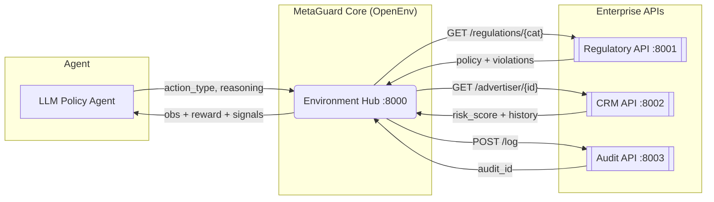

# MetaGuard: A Multi-App RL Environment for Ad Policy Compliance

> An OpenEnv-compatible reinforcement learning environment that forces an LLM agent
> to do **real investigative work** across multiple enterprise APIs — not pattern-match.


---

## Quick links

| Asset | URL |
| --- | --- |
| **Hugging Face Space** (environment) | [huggingface.co/spaces/parth-1/MetaGuard](https://huggingface.co/spaces/parth-1/MetaGuard) |
| **Hugging Face Space** (GRPO training) | [huggingface.co/spaces/parth-1/MetaGuard-Train](https://huggingface.co/spaces/parth-1/MetaGuard-Train) |
| **Fine-tuned model** (GRPO checkpoint) | [parth-1/metaguard-policy-agent-v1](https://huggingface.co/parth-1/metaguard-policy-agent-v1) |
| **Training notebook** | [Open in Colab](https://colab.research.google.com/github/Parth380/meta-ad-policy-sandbox/blob/main/grpo_train.ipynb) |
| **Blog post** | [Draft in repo (`docs/metaguard-blog.md`)](https://github.com/Parth380/meta-ad-policy-sandbox/blob/main/docs/metaguard-blog.md) |


---

## TL;DR for Judges

MetaGuard is a **partially observable, multi-application RL environment** modelled
after a real enterprise ad-moderation workflow. The agent (LLM) must orchestrate
calls across 4 microservices (Regulatory, CRM, Audit, Core), update its internal
beliefs based on each tool result, and produce a defensible decision in the
correct procedural order — or get penalised.

| Theme 3.1 requirement | How MetaGuard satisfies it |
| --- | --- |
| Real interaction with tools / APIs / dynamic systems | 4 independent FastAPI microservices on ports 8000-8003 |
| "Real hard work, not shortcuts" | Procedural penalties + ambiguity tasks force investigation |
| Maintain consistent internal state | Env tracks `actions_taken`, `signals`, `api_failed`, `trace` |
| Update beliefs based on outcomes | `signals` dict is populated only as the agent acts |
| Orchestrate multi-step workflows | `REQUIRED_BEFORE_TERMINAL` enforces `query_regulations` → `submit_audit` → decide |
| Partially observable world | Agent sees only what its actions reveal; no global view |
| **Scaler AI Labs bonus** | 4-app architecture mirrors a real compliance stack |

---

## The Problem

Single-shot LLM moderation is brittle in enterprise settings:
- **No traceability** — no record of *why* a decision was made.
- **No context** — no advertiser history, no jurisdiction-specific rules.
- **No risk gating** — high-risk content can be approved without an audit trail.

Real compliance teams follow a **procedure**: check policy → inspect creative → verify the advertiser → log the audit → only then decide. MetaGuard makes the agent learn that procedure end-to-end.

---

## Architecture

A 4-service ecosystem that mirrors a real enterprise compliance stack.



| Service | Port | Responsibility | Real-world analog |
| :--- | :--- | :--- | :--- |
| Core Env | `:8000` | State orchestration, reward shaping | Compliance workflow engine |
| Regulatory API | `:8001` | Category-specific policy lookup | Legal / policy database |
| CRM API | `:8002` | Advertiser trust score and history | Salesforce / advertiser CRM |
| Audit API | `:8003` | Immutable audit-log writes | SOX-compliant audit ledger |

*Note: External APIs have a 10% random failure rate. The agent must learn to retry.*

---

## Action Space & Business Rules

8 actions span the full investigative procedure. The environment penalizes shortcuts and rewards real reasoning:

1. **Phase ordering:** `query_regulations` MUST come first. 
2. **Audit gate:** `submit_audit` is required before any `approve` / `reject`.
3. **API-failure recovery:** Recovering from 10% injected API failures earns `+0.3`; ignoring earns `-0.3`.
4. **Risk-aware approvals:** Approving high-risk content (`risk_score > 0.7` AND `policy_confidence > 0.6`) costs `-0.5`.
5. **Ambiguity enforcement:** When `policy_confidence < 0.6`, the agent MUST gather more signals or take a penalty.
6. **Step cap:** Hard cap at 8 steps.

---

## Training & Results

Training uses **[OpenEnv](https://github.com/openenv-ai/openenv)** as the environment, **[Unsloth](https://github.com/unslothai/unsloth)** for fast LoRA fine-tuning, and **[Hugging Face TRL](https://github.com/huggingface/trl)** for GRPO. The trained weights are on the Hub as **[parth-1/metaguard-policy-agent-v1](https://huggingface.co/parth-1/metaguard-policy-agent-v1)**.

### Evaluation Metrics
The model was evaluated across a 4-task suite testing healthcare, financial, multimodal, and targeting policies.

* **Baseline (Pre-GRPO):** Success Rate: 0/4 (0%) | Mean Reward per Step: -0.185
* **Final (Post-GRPO):** Success Rate: 0/4 (0%) | Mean Reward per Step: -0.050

**Conclusion:** The GRPO fine-tuning successfully improved the agent's intermediate signal gathering phase, significantly pulling the mean reward up from the baseline. However, the model still struggles with strict terminal sequence chaining (failing to call `submit_audit` before the final decision).

---

## Quick Start & Inference

### ⚠️ Critical Warning: 422 Schema Errors
The MetaGuard API enforces strict JSON validation (`additionalProperties: false`). Generative models will often hallucinate extra keys, causing the server to throw `422 Unprocessable Entity` errors. You **must** sanitize the LLM output before passing it to the environment.

**Required Parser Patch for `inference.py` / `demo.py`:**
```python
import json

def parse_attempt(text):
    candidates = []
    if "```" in text:
        for p in text.split("```"):
            p = p.strip().lstrip("json").strip()
            candidates.append(p)
    candidates.append(text.strip())
    s, e = text.find("{"), text.rfind("}") + 1
    if s != -1 and e > s:
        candidates.append(text[s:e])
        
    for c in candidates:
        try:
            r = json.loads(c)
            if isinstance(r, dict) and "action_type" in r:
                r.setdefault("reasoning", "No reasoning provided.")
                
                valid_cat = {"HEALTHCARE", "FINANCIAL", "NONE", None}
                if r.get("violation_category") not in valid_cat:
                    r.pop("violation_category", None)
                    
                allowed = {"action_type", "reasoning", "violation_category", "metadata"}
                return {k: v for k, v in r.items() if k in allowed}
        except Exception:
            continue
    return None
```

### 1. Install & Launch
```bash
git clone [https://github.com/Parth380/meta-ad-policy-sandbox.git](https://github.com/Parth380/meta-ad-policy-sandbox.git)
cd meta-ad-policy-sandbox
pip install -e .

# Launch the 4-service stack (Use apps/start_all.bat on Windows)
python apps/regulatory_api.py &
python apps/crm_api.py &
python apps/audit_api.py &
python -m uvicorn server.app:app --host 0.0.0.0 --port 8000
```

### 2. Run Benchmarks or Train
```bash
# Run inference evaluation
export HF_TOKEN=hf_xxxxxxxx
export MODEL_NAME=meta-llama/Meta-Llama-3-8B-Instruct
python inference.py

# Train an agent (Unsloth + TRL GRPO)
python grpo_train.py
```

---

## Hackathon Submission

- **Theme:** 3.1 Professional Tasks — Multi-Step Reasoning & Policy Compliance
- **Bonus Track:** Scaler AI Labs — Multi-App RL Environment for Enterprise Workflows
- **Team:** Parth Singhal, Mehakveer Kaur, Kartik Goyal

---

## License
MIT.
